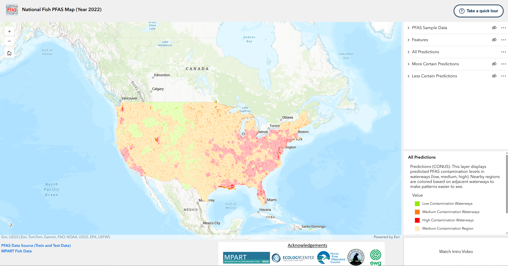

# PFAS Environmental Risk Dashboard

An interactive geospatial dashboard for exploring PFAS contamination
risk predictions alongside environmental and hydrological information.

  

  <b><a href="https://pfas-dashboard.netlify.app/">Launch Interactive Dashboard →</a></b>

## Overview

This dashboard provides an interactive interface for exploring predicted
PFAS contamination risk across geographic regions. It combines machine
learning predictions with environmental, hydrological, and potential
PFAS-source information to support spatial exploration of contamination
patterns.

## Features

- 🗺️ Interactive geospatial PFAS risk visualization
- 🔬 Machine-learning-based risk predictions
- 🌎 Multiple environmental and remote-sensing data sources

## Research

The dashboard accompanies our research on machine learning for PFAS
contamination mapping and environmental monitoring.

Additional details about the models, datasets, and methodology will be
provided with the associated research release.

## Dashboard

**[Open the live PFAS Dashboard →](YOUR_NETLIFY_URL)**

## Authors

Jowaria Khan  
University of Michigan
